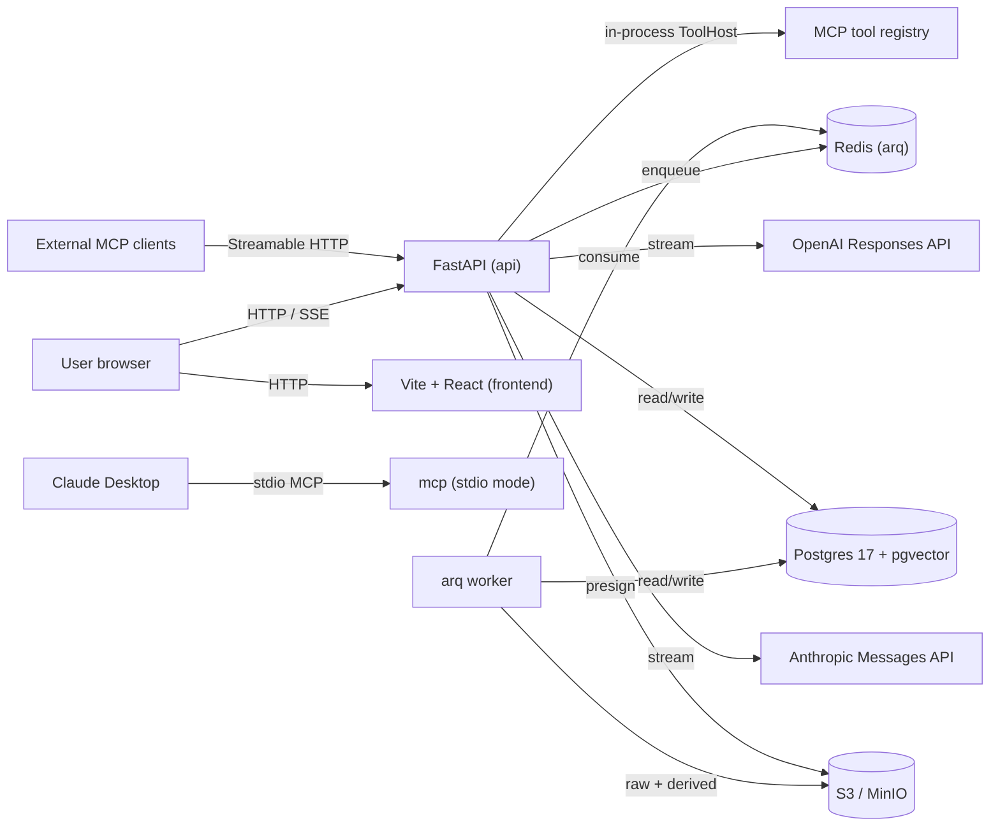

# Architecture

A single Python package (`my_family_tree`) runs as three processes from one
container image, plus a Postgres + pgvector database, Redis, MinIO/S3, and a
Vite + React frontend.

## Process boundaries

| Process | Image | Command | Notes |
|---------|-------|---------|-------|
| api     | backend | `uvicorn ... --factory` | FastAPI; mounts MCP HTTP at `/mcp`; SSE chat |
| worker  | backend | `arq ... WorkerSettings` | ingestion, embeddings, claim extraction, deep research |
| mcp     | backend | `mft mcp --transport http` | dedicated MCP HTTP service for external clients (Claude Desktop, CI) |

The chat agent uses the **in-process `ToolHost`** to call MCP tool handlers
without serialization. The dedicated `mcp` service exists so external clients
can use the same registry over the standard transport. Same handler functions,
three ways in.

## Why this shape

- One image, three processes. We never have to keep `pip` deps in sync across
  separate codebases.
- Real MCP server, not a "MCP-style" abstraction. Claude Desktop and other
  external tools can drive the tree directly.
- Read freely, write only via proposals. The agent never mutates canonical
  entities; it creates `proposal` rows the user (or an explicit auto-approve
  policy) applies via the API.
