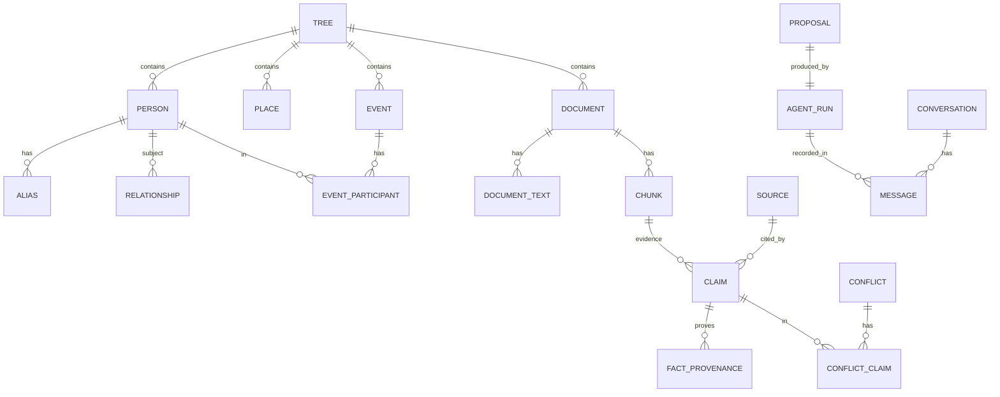

# Data model

The schema lives at `backend/src/my_family_tree/models/`. Conventions:

- All primary keys are `UUID` generated as **UUIDv7** via `uuid_utils.uuid7()`
  for time-ordered B-tree locality on hot tables.
- Every domain row carries `tree_id` even though v1 is single-user.
- Soft delete via `deleted_at` (default null).
- Postgres ENUMs (`models/enums.py`) are created in the initial migration so
  multiple tables can share the same type.
- Date uncertainty is an inline triple on rows that need it: `date_text`
  (verbatim), `date_min`, `date_max`, `date_precision`, `date_circa`.
- Vector columns: full `vector(3072)` plus an indexable `halfvec(3072)`
  (full-precision cannot be HNSW-indexed; halfvec can).

## Rule the LLM lives by

Claims are the only thing the LLM writes during ingestion. A claim is an
attributable assertion with confidence and a chunk-level provenance pointer.
Updates to canonical entities (Person, Event, Relationship) only happen when a
claim is **accepted**, driven by an approved `proposal`. Acceptance writes a
`fact_provenance` row so we can answer "why do we believe X?" instantly.

## Aggregate map

See `models/__init__.py` for the canonical list of tables.
