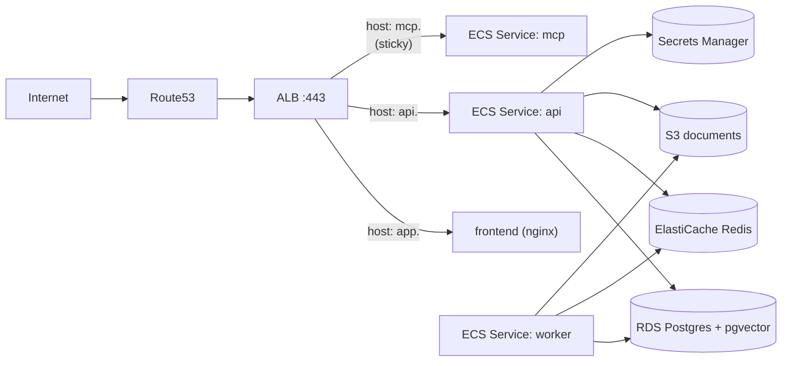

# Deployment

Terraform on AWS. Topology:



## One-time bootstrap

1. `cd infra/terraform/bootstrap && terraform init && terraform apply`
2. Note the `state_bucket` and `lock_table` outputs.
3. Edit `envs/dev/backend.tf` and `envs/prod/backend.tf` to enable the remote
   backend with those names.

## Per-env apply

```bash
cd infra/terraform/envs/dev
terraform init
terraform plan
terraform apply
```

I never run `apply` from CI; it stays a deliberate human action. CI only runs
`terraform fmt -check` and `terraform validate`.

## Migrations on deploy

`alembic upgrade head` runs as a one-shot ECS RunTask invoked **before**
service updates. Don't run it from the api startup; multi-task deploys race
the lock and your service times out.

## Secrets

Populate Secrets Manager entries via `aws secretsmanager put-secret-value`.
The Terraform `secrets` module creates empty entries; no secret values live in
state.

## Branch protection

Run `scripts/setup-branch-protection.sh <owner> <repo>` once after the repo
exists on GitHub. Required checks: `backend (lint + typecheck)`, `backend
(unit tests)`, `frontend (lint + test + build)`, `terraform (fmt + validate)`,
`docker (smoke build)`.
